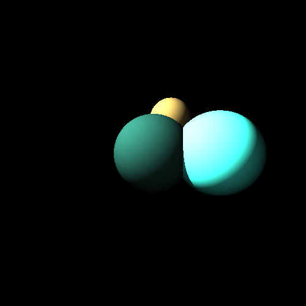

# Raytracer

A Raytracer is a computer program for generating an image by tracing the path of light as pixels in an image plane and simulating the effects of its encounters with virtual objects.

```
$ python run.py
Generation 0.0%
Generation 10.0%
Generation 20.0%
Generation 30.0%
Generation 40.0%
Generation 50.0%
Generation 60.0%
Generation 70.0%
Generation 80.0%
Generation 90.0%
Saving image.png
Done
$ feh image.png
```



# Installing dependencies

```
$ python -m venv
$ source env/bin/activate
$ pip install -r requirements.txt
```

Python 3.8 is supported.

# Features

* [x] Render Spheres
* [x] Render Spherical Light Sources
* [x] Render Shadows
* [x] Configure FOV
* [ ] Render Planes
* [ ] Load Scene from File
* [ ] Parse cli arguments for configuration
* [ ] Render Reflections
* [ ] Render Refraction
* [ ] Render Fresnel
